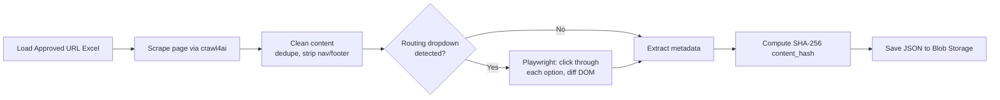
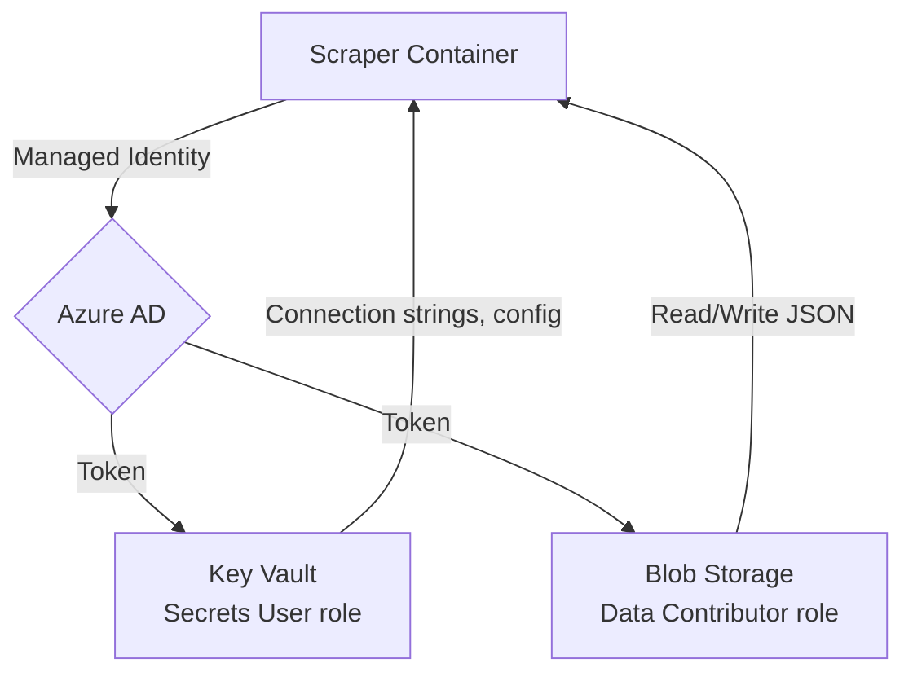
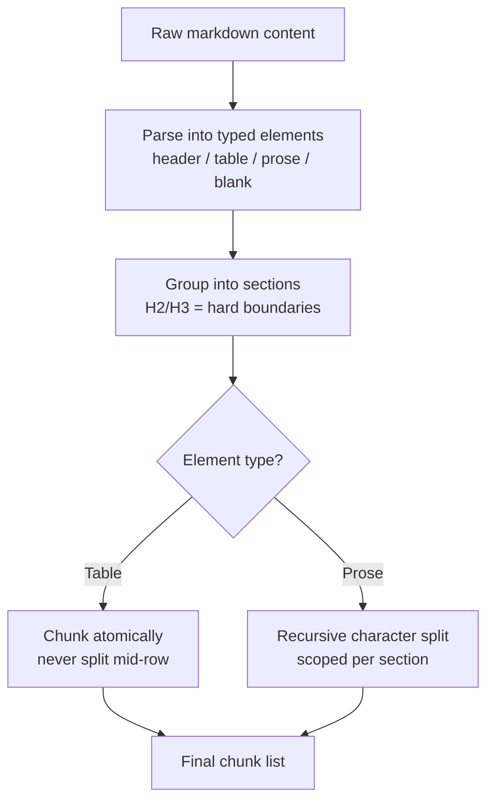
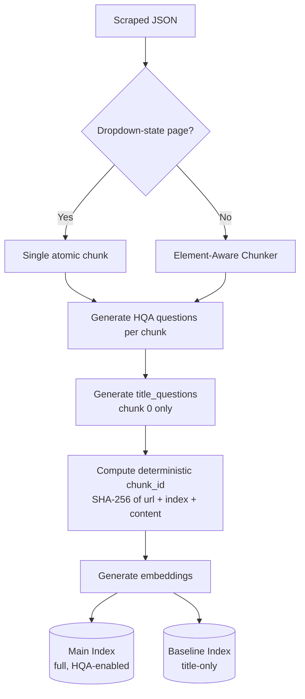
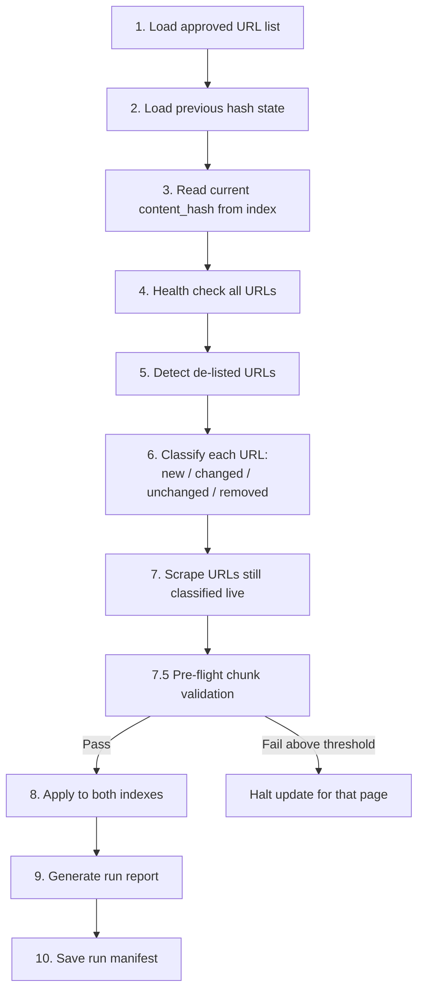
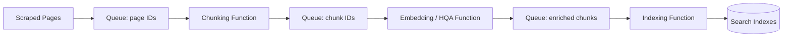

[[_TOC_]]

# Digital Assistance — Offline Content Pipeline: Low-Level Design

**Project:** Digital Assistance — Royal London Group Digital Assistant
**Scope:** Offline content pipeline (Scraper → Element-Aware Chunker → Chunk & Index → Content Freshness)
**Document type:** Low-Level Design (LLD)
**Status:** Draft for review

---

## 1. Purpose & Scope

This document describes the low-level design of the four components that make up the **offline content pipeline** for the Digital Assistance RAG chatbot.

### 1.1 Components Covered

| # | Component | Role |
|---|---|---|
| 1 | Scraper | Scrapes the FCA-approved URL list into structured JSON |
| 2 | Element-Aware Chunker | Shared chunking engine used by both the indexer and the freshness job |
| 3 | Chunk & Index | Chunks, augments, embeds, and indexes content into Azure AI Search |
| 4 | Content Freshness | Nightly incremental sync between the live site and both search indexes |

### 1.2 Governing Constraint

The system may only scrape and index a **fixed, pre-approved list of Royal London URLs**, maintained as an Excel file under FCA compliance control. This constraint is architectural, not incidental — it shapes URL loading (list-driven, never crawled/discovered), the freshness job's de-listing behaviour, and the deliberate absence of any content-discovery logic anywhere in the pipeline.

---

## 2. Architecture Overview

### 2.1 High-Level Pipeline Flow

**[[IMAGE: offline_script_simpleflow.png — drop the "Offline Pipeline — Simple Flow" diagram here]]**

The pipeline consists of three deployable jobs: the Scraper and Indexer run on manual trigger, and Content Freshness runs nightly. The Element-Aware Chunker is a shared module used by the Indexer and independently mirrored inside Content Freshness.

### 2.2 Detailed Pipeline Flow

**[[IMAGE: offline_script.png — drop the full "Digital Assistance — Offline Pipeline LLD" diagram here (all 4 scripts, 10 freshness steps, legend)]]**

This diagram expands each of the three job zones — Scraper, Indexer, and Content Freshness — showing the underlying script names, key functions, and the full 10-step freshness flow including the Step 7.5 pre-flight safety checkpoint.

### 2.3 Trigger Model

| Component | Trigger | Reasoning |
|---|---|---|
| Scraper | On-demand | Full scrape is only needed after an approved-URL-list change |
| Chunk & Index | On-demand, full run | Expensive (LLM calls per chunk) — not run on a schedule |
| Content Freshness | Nightly, automated | Cheap by design (hash-gated) — safe to run unattended every night |

Content Freshness is the only component that runs unattended in production and is therefore held to the highest reliability bar of the four (see Section 6.4).

---

## 3. Component 1 — Scraper

### 3.1 Approach

1. Load the approved URL list from Excel (Blob Storage in production, local file for development). Column detection is **header-name based**, not positional, so the sheet can be reordered without breaking the script.
2. For each URL, `crawl4ai` fetches and renders the page, extracting markdown content and stripping non-article chrome.
3. Content is cleaned: duplicate article copy removed, breadcrumb navigation stripped, social-share sections stripped, footer boilerplate stripped.
4. Pages containing **routing dropdowns** (selectors that change page content without a URL change) are detected via a DOM scan of the already-fetched HTML, then handed to **Playwright** to programmatically click through every option, diffing DOM text per option. This produces one JSON record per dropdown option, plus a truncated base/intro record for the page itself.
5. Rich metadata is extracted from the same HTML pass — content type, product category, audience, publish date, read time — with no additional HTTP round-trips.
6. A SHA-256 `content_hash` is computed on the **cleaned** content and stored per page. This is the single source of truth the Content Freshness component compares against on every run.
7. Output is saved as structured JSON.

### 3.2 Design Considerations

| Decision | Reasoning |
|---|---|
| Dual browser mode: CDP-attach (development) vs. bundled Chromium (production) | Development environments may restrict automated browser binary downloads. Rather than work around this per-machine, the scraper attaches to an existing browser via Chrome DevTools Protocol when a local executable path is configured, and falls back to a self-contained bundled browser otherwise. Production never sets this path, so it always uses the sandboxed bundled browser. |
| Single environment variable gates the mode switch | No branching logic in application code — the deployment configuration simply never sets the local-path variable in production. |
| Dropdown pages stored as truncated intro + per-option detail | Some Royal London pages render every dropdown option's content into the DOM simultaneously. Scraping the "full" page naively captured every option's text multiple times over, bloating hashes and chunks and making a single edit look like several changes. Truncating the base page at the first dropdown marker and sourcing full detail per-option via Playwright resolved this. |
| Header-based Excel column detection | The approved-URL sheet is externally owned and periodically reformatted. Header-name matching survives reformatting; hardcoded column indices would not. |
| Live HTTP status check, not the Excel status column | The Excel status column reflects verification-time state, not scrape-time state. A live check at scrape time is the authoritative signal. |
| Hash computed on cleaned content, not raw HTML | Keeps the hash stable against irrelevant markup/whitespace noise, and must exactly match how the freshness component computes its comparison hash (see Section 6.2). |

### 3.3 Challenges Encountered

- **Automated browser binary download restrictions in development environments** — resolved via the CDP-attach mode described above.
- **Dropdown content duplication** — resolved via truncate-and-per-option scraping.
- **Stale status data in the source Excel** — resolved via a live HTTP check at scrape time.
- **Navigation race condition** on dropdown/filter clicks — Playwright occasionally raises an execution-context error when a click triggers a client-side route change mid-read. Retry logic absorbs this at low frequency; the underlying race condition itself remains an open item rather than a root-caused fix.

### 3.4 Security Considerations

#### 3.4.1 Credential & Secrets Handling

- **No API keys, service principals, or stored credentials** are used anywhere in the pipeline. Credential-based Azure authentication resolves automatically via **Managed Identity**.
- **Least-privilege RBAC**, scoped per resource:

  | Resource | Role granted |
  |---|---|
  | Azure Blob Storage | Storage Blob Data Contributor |
  | Azure Key Vault | Key Vault Secrets User |

- **All connection strings and configuration live in Key Vault**, never in source code, container images, or plaintext environment variables.
- The local-browser-executable-path variable used in development is **explicitly excluded from Key Vault and from any production configuration store**. This is a deliberate control: if it were ever present in production, the application would attempt to launch a non-existent local browser path instead of using the properly sandboxed bundled browser.

#### 3.4.2 Scraping-Scope Enforcement

- The scraper contains **no crawling, link-following, or content-discovery logic**. It only ever fetches the exact URLs (and their dropdown option states) present in the approved list. There is no code path by which an unapproved page could be fetched, scraped, or indexed.
- The approved URL list itself is the compliance record. Any change to what gets scraped requires an update to that externally-controlled document, not a code change — keeping the audit trail outside the engineering change-control process.

#### 3.4.3 Network Egress

- The scraper requires outbound HTTPS only to the target public domain and to Azure resources (Blob Storage, Key Vault). No inbound exposure is required, since this runs as a job rather than a service.
- Recommended control: restrict outbound network access on the hosting environment to the minimum required domains, rather than unrestricted egress, to reduce the impact of a compromised dependency.

#### 3.4.4 Browser/Runtime Attack Surface

- The bundled browser engine is the largest dependency surface in this component. The production image installs its own browser binary with its full system-library dependency set, rather than relying on a host browser.
- Browser CVEs are frequent; this image should be rebuilt and patched on a regular cadence rather than treated as a one-time build.
- No user-supplied input reaches the browser — URLs originate only from the approved list — which significantly reduces injection/SSRF-style risk compared to a general-purpose scraper.

#### 3.4.5 Data Handling

- Scraped content is publicly available Royal London web content, not customer PII, at this stage of the pipeline.

---

## 4. Component 2 — Element-Aware Chunker

### 4.1 Approach

A three-stage pipeline, used as a shared function by the Chunk & Index component and mirrored (not imported) inside the Content Freshness component (see Section 6.4 for why):

1. **Parse** — markdown content is parsed into an ordered list of typed elements: header, table, prose, blank.
2. **Group into sections** — level-2/level-3 headers act as hard section boundaries; deeper headers remain in-section formatting rather than new boundaries.
3. **Convert to chunks**:
   - Tables are chunked **atomically** and never split mid-row. A row cap exists as a safety net for unusually large tables, not as the normal path.
   - Prose is split using a recursive character splitter, but scoped **per section**, so content can never be pulled across a topic boundary into one chunk.

### 4.2 Design Considerations

| Decision | Reasoning |
|---|---|
| Fast path for pages with no headers or tables | The large majority of approved pages have simple structure and receive output identical to a plain splitter — the element-aware logic activates only where structure requires it, minimising regression risk. |
| Tab-style content requires no special handling | Tab content was found to already render as ordinary section headers in the underlying markdown extraction, so treating them as normal section headers was sufficient. A dedicated tab-content scraper was evaluated and retired as unnecessary. |
| Table atomicity prioritised over size-balanced chunks | A table row split across two chunks produces incorrect or unreadable retrieval results (e.g. a price separated from its associated label). Accepting less uniform chunk sizes in exchange for semantically complete chunks was the correct trade-off. |

### 4.3 Challenges Encountered

- An audit found a significant share of table-bearing pages being split mid-row by the previous flat character splitter, and FAQ/tab-style pages bleeding unrelated topics into single chunks. This component exists specifically to correct both failure modes.
- Dense, deeply nested pages mixing tables and prose remain a documented hard case rather than a fully solved one, to avoid further special-casing that would add fragility elsewhere.

---

## 5. Component 3 — Chunk & Index

### 5.1 Approach

1. Load scraped JSON.
2. Route each page: dropdown-state pages become a **single atomic chunk**, so related fields (e.g. a phone number and its associated label) never separate; standard pages go through the Element-Aware Chunker.
3. **Question augmentation**: for each chunk, a language model generates a small set of customer-phrased questions the chunk answers. The chunk's embedding is built from content **and** the generated questions combined, not content alone.
4. **Entry-point questions**: for the first chunk of each page only, a small number of additional broad questions are generated and boosted via a search scoring profile.
5. A deterministic chunk identifier — a hash of the URL, chunk index, and content — is assigned. Re-running indexing on unchanged content reproduces identical identifiers, making the process idempotent and safe to re-run.
6. Two indexes are maintained in parallel: a full index with question augmentation, and a baseline index without it, to support controlled comparison of retrieval quality.

### 5.2 Design Considerations

| Decision | Reasoning |
|---|---|
| Question augmentation at all | Query embeddings represent how a user phrases a question; chunk embeddings represent how source content is written. Similarity between the two is structurally weak. Embedding synthetic customer-style questions alongside the chunk closes that gap directly. |
| Looser validation for entry-point questions than for regular augmented questions | Regular question generation rejects overly generic questions as low-value. An entry-point question is supposed to be broad — it exists to catch broad top-level queries that would otherwise lose to high-chunk-volume specific pages. Applying the strict filter here would defeat its purpose. |
| Deterministic chunk identifier over a random identifier | Enables safe re-runs — unchanged content produces the same identifier and a clean update rather than a duplicate — and gives downstream components a stable key to compare against. |
| Two indexes rather than one | Allows controlled comparison of the cost/latency/complexity of question augmentation against a simpler baseline using real usage data before committing fully to one approach. |

### 5.3 Challenges Encountered

- A significant volume of duplicate chunks was identified and cleaned; the root cause was earlier indexing runs using randomly generated identifiers, creating new chunks on every re-run instead of updating existing ones.
- Question generation requires a model call per chunk, not per page — this is the primary reason indexing is run on demand rather than on a schedule, and the reason the freshness component's hash-based gating (Section 6) functions as a cost control, not only an efficiency improvement.

---

## 6. Component 4 — Content Freshness

### 6.1 Approach — Pipeline Flow

1. Load the approved URL list.
2. Load the previous run's hash state.
3. Read the current stored content hash per URL from the live index.
4. **Health check** every approved URL — HTTP status only, no content fetch.
5. Detect de-listed URLs — present in the index but absent from the current approved list.
6. **Classify** each URL: new, pending content check, removed (error/redirect/de-listed), or unchanged.
7. **Scrape** every URL still classified as live — a genuine full re-fetch (see Section 6.2 for why this is necessary).
8. **Pre-flight chunk validation** (Section 6.3).
9. Apply changes to **both** indexes — delete stale chunks and write new ones, only for pages whose hash changed.
10. Generate a run report.
11. Save the run manifest for the next run's comparison.

### 6.2 Change-Detection Strategy

There is no percentage- or threshold-based change detection in this pipeline. Change detection is a strict equality comparison.

- Every URL still classified as live is **fully re-scraped** on each run — there is no lower-cost way to determine whether source content changed without fetching it.
- Immediately after scraping, the new hash is compared exactly against the hash stored in the index. Any difference triggers reprocessing; no difference means the re-scrape is discarded with no further action.
- Content is cleaned — breadcrumb navigation, social-share sections, footer boilerplate, and duplicate article copy are stripped — **before** the hash is computed, using an identical cleaning function on both the scraping side and the freshness side. As a result, changes limited to navigation, footer, or styling never affect the hash and correctly produce no reprocessing.
- **Reprocessing scope for a genuine content change**: hashing operates at the whole-page level, not per-chunk or per-sentence. A single sentence edited on a page causes every chunk on that page to be re-chunked, re-augmented, and re-embedded — old chunks deleted and new chunks written, in both indexes — plus a targeted cache invalidation for that URL. This does not affect any other URL's chunks. This is a known, accepted trade-off (Section 6.5).
- An early implementation computed the freshness-side hash on uncleaned content while the index held cleaned content, causing nearly every comparison to mismatch regardless of whether real changes existed. This was resolved by using the identical cleaning function, in the identical order, on both sides.

### 6.3 Pre-Flight Validation

Every freshly scraped, hash-changed page is chunked and validated — no processing exceptions, a sane chunk count, no oversized chunk — **before** any deletion occurs against the live index. If the validation failure ratio for a page exceeds a defined safety threshold, that page's update is halted rather than partially applied. This guarantees the pipeline never deletes existing valid chunks before confirming their replacement is valid.

### 6.4 Design Consideration — Deliberate Code Isolation

The Content Freshness component does not import the Element-Aware Chunker or the scraping/indexing modules — its chunking logic is a manually maintained, mirrored copy. This is a deliberate reliability decision: Content Freshness is the only unattended, nightly, production-critical component in this pipeline. Isolating it means a change to shared chunking logic elsewhere cannot silently break the nightly job. The cost is a manual synchronisation requirement — a chunking-logic change must be ported to both places — accepted as the safer failure mode given the compliance exposure of this system.

### 6.5 Design Consideration — Whole-Page vs. Sub-Page Reprocessing

This is a documented, known limitation rather than a defect. The pipeline does not attempt sentence- or paragraph-level diffing or partial-chunk patching, because:
- Partial patching risks inconsistency within a single page — some chunks reflecting old content, some new.
- Given current content update frequency and page sizes, whole-page reprocessing cost is acceptable.
- If update frequency increases materially, this is the first area to revisit — see Section 8 for a related architectural option.

### 6.6 Challenges Encountered

- The hash-mismatch incident described in Section 6.2.
- The navigation race condition inherited from the scraping component on dropdown pages.
- Targeted Redis cache invalidation — invalidating only the affected keys, rather than a blanket flush — required care to avoid serving stale answers after a content update without over-invalidating unrelated cached queries.

---

## 7. Deployment Model — Container Apps Jobs and Alternatives

### 7.1 Current Model

All four components run as containerised jobs on a serverless container job platform, chosen for the following reasons:
- Native container support, required for the scraper's browser-automation dependency footprint.
- Both manual and scheduled trigger modes supported natively.
- Scale-to-zero when idle.
- Straightforward integration with identity-based authentication and centralised secret storage.
- Built-in run history and logging.

### 7.2 Alternative Options Considered

| Option | Suitability | Assessment |
|---|---|---|
| Serverless functions (consumption or dedicated plan) | Suitable for the chunking/indexing/freshness logic; unsuitable for the scraper | The scraper's browser-automation dependency requires a full system-library set and a large image. A consumption-based functions plan cannot host this; a dedicated/premium plan would require a custom container, converging back toward the current model while adding execution-timeout and orchestration complexity for a job that can legitimately run longer than a function's default execution window. |
| Batch computing service | Technically possible | Built for large-scale parallel job execution. Adds a second orchestration paradigm to the stack without a corresponding benefit at the current scale (a few hundred URLs); would only be justified by a need for large-scale concurrent fan-out, which is not the current profile. |
| Virtual machines / scale sets with scheduled tasks | Not recommended | Reintroduces OS patching and management overhead that a managed container platform is specifically intended to avoid, with no scale-to-zero cost benefit. |

### 7.3 Recommendation

Retain the current containerised job model for the scraper, given the browser-automation dependency. The indexing side is a stronger candidate for a different execution model — see Section 8.

---

## 8. Feasibility — Separating Chunking, Embedding, and Indexing

### 8.1 Summary

Splitting the chunking, embedding, and indexing stages into independently executable units — for example, as separate serverless functions connected by a queue — is technically feasible and has a genuine benefit case. It changes the reliability and complexity profile of the pipeline and is recommended as a scoped follow-up rather than an immediate change.

### 8.2 Why It Is Feasible

Unlike the scraper, the chunk/index logic has no browser-automation dependency. Its three sub-stages separate naturally:
- **Chunking** — CPU-bound, fast, no external calls.
- **Embedding and question generation** — I/O-bound (language model calls); the primary cost and latency driver.
- **Indexing** — I/O-bound, fast per call, against the search index.

These map onto separate functions chained via queue-based or durable-orchestration patterns: scrape produces a queue of page identifiers; a chunking function consumes it and produces a queue of chunk identifiers; an embedding/augmentation function consumes that and produces a queue of enriched chunks; an indexing function consumes that and writes to the search indexes.

### 8.3 Potential Benefits

- **Granular retry** — a single failed embedding call currently risks the entire indexing run for a page; a queue-based design retries only the failed unit.
- **Cost visibility** — consumption-based billing would make the cost of the embedding/augmentation stage (the expensive part) visible separately from the cheap chunking and indexing stages.
- **Foundation for finer-grained reprocessing** — directly addresses the whole-page reprocessing limitation noted in Section 6.5. A queue-per-chunk architecture is a natural foundation if sub-page diffing is pursued in future.
- **Independent scaling** — the embedding stage could scale independently of chunking and indexing, rather than the current single-process sequential execution.

### 8.4 Costs and Risks

- **Increased orchestration complexity** — multiple functions, queues, and orchestration state replace a single linear script, adding failure modes such as partial completion, poison messages, and out-of-order processing.
- **Deterministic chunk identifiers and dual-index-write consistency become harder to reason about** across asynchronous, distributed stages. A single process currently guarantees ordering; a queue-based pipeline requires explicit idempotency and ordering guarantees to be re-engineered.
- **Local development and testing become harder** — the current single-process approach is straightforward to run and debug locally; a distributed functions pipeline requires additional local emulation tooling, raising the iteration cost during development.
- **Pre-flight validation requires redesign** — this currently works because all processing for a page happens in one place before any deletion occurs. Splitting stages means this safety gate must become a distributed check (all chunk-stage work for a page must complete successfully before the index-stage is permitted to run), which is a genuine design task rather than an infrastructure change.

### 8.5 Recommendation

Scope this as a dedicated follow-up investigation rather than an immediate architecture change, for two reasons: current content update frequency does not yet justify the added complexity, and the pre-flight validation redesign (Section 8.4) requires proper design time rather than a retrofit under time pressure.

---

## 9. DevOps Plan

### 9.1 Proposed Approach

| Area | Approach | Reasoning |
|---|---|---|
| Infrastructure as Code | All resources defined as code (container job definitions, container registry, cache, content safety, secret store references), version-controlled | Reproducible environments, auditable change history appropriate for a regulated system, avoids manual configuration drift. |
| Container registry | Images built and pushed via a CI pipeline, pulled by the container job platform using identity-based authentication — no registry credentials in the pipeline | Controls image provenance and avoids an additional credential to manage and rotate. |
| Identity model | A managed identity per job, scoped to least-privilege roles per resource — no service principals, no API keys anywhere in the pipeline | Identity-based authentication end-to-end is a security requirement, not a preference, and this is the model that satisfies it cleanly on the chosen platform. |
| Secrets management | A centralised secret store is the single source of truth for all connection strings and configuration; nothing is stored in source control, container images, or plaintext environment variables | Standard secret-hygiene practice; also provides a single place to update configuration, such as switching the active index, without a redeploy. |
| Trigger model | Scraper and indexer: manually triggered, following an approved-URL-list update. Freshness: nightly scheduled trigger | Matches actual content update cadence — the expensive full pipeline does not need to run on a fixed schedule, while the freshness job is inexpensive by design (hash-gated) and safe to run nightly. |
| Full re-index run order | Scrape → index (full run) → update active index configuration → restart the serving application → run freshness in report-only mode to verify → enable nightly scheduling | Verifying in report-only mode before the first live scheduled run is a deliberate safety gate, preventing an unverified freshness run from writing to production. |
| Environment separation | A development-oriented mode (local browser attach, local configuration) and a production mode (bundled browser, centralised secret store), switched purely by configuration, with no code branching | Keeps local iteration fast without requiring full cloud provisioning for every change, while guaranteeing production cannot accidentally use the development code path. |
| Monitoring and alerting | Job run history and structured logging, surfaced to the organisation's standard observability stack | Tooling to be finalised; flagged as an open item below rather than assumed. |

### 9.2 Rationale

The guiding principle is to use the simplest platform-native option that satisfies the security requirement (identity-based authentication and centralised secrets throughout) and matches actual usage cadence — on-demand for expensive and infrequent operations, scheduled for cheap and frequent ones — rather than introducing orchestration complexity ahead of a demonstrated need. The function-based split discussed in Section 8 is deliberately excluded from the current plan for this reason: it becomes worthwhile once the reprocessing-granularity need is real, not before.

### 9.3 Open Items

- Cache and content-safety resources are provisioned; integration testing is still pending.
- Server-side conversation history storage is not yet provisioned, deferred from an earlier sprint pending compliance approval.
- Network egress restriction on the scraper's hosting environment is proposed but not yet confirmed as feasible within the organisation's networking model.
- A patching cadence and ownership for the browser-automation base image (Section 3.4.4) has not yet been assigned.

---

## 10. Cross-Cutting Design Principles

1. **Approved-content scope is enforced structurally**, not by convention — no discovery or crawling logic exists anywhere in the pipeline.
2. **Content hashing is the backbone** connecting scraping, indexing, and freshness — enabling idempotent re-runs and exact-match change detection.
3. **No credentials are stored anywhere** — identity-based authentication and a centralised secret store are used end-to-end.
4. **Expensive stages are protected from unnecessary reprocessing** via hash-gating, while cheap stages run against the full approved URL set on every execution.
5. **The single unattended production job is deliberately isolated** from shared-code changes elsewhere, at the cost of a manual synchronisation discipline.
6. **Design decisions in this pipeline trace back to specific production findings**, not speculative engineering, and are documented at the point they apply throughout this document.

---

*End of document.*
