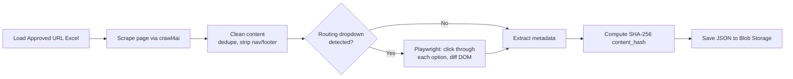
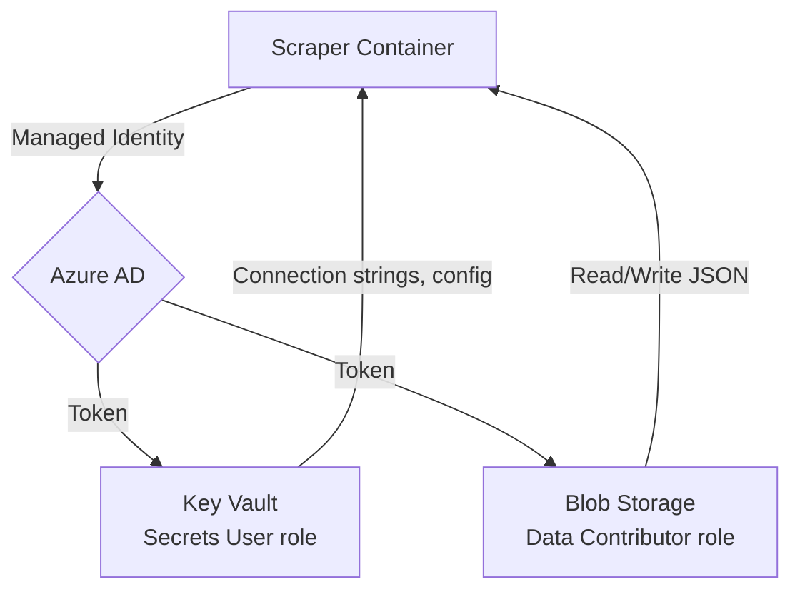
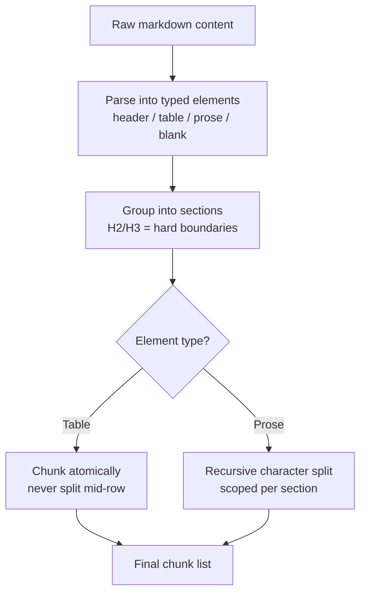
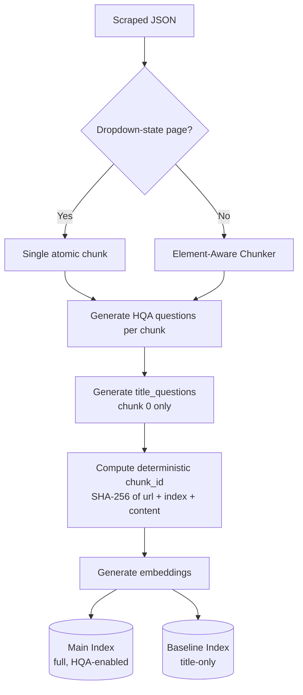
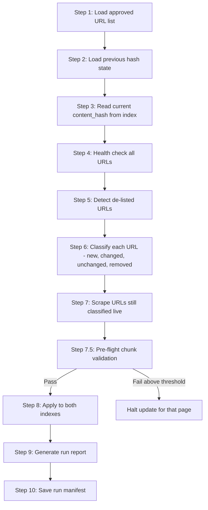
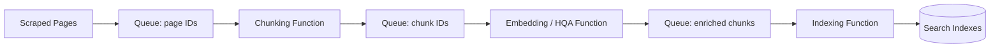

[[_TOC_]]

# Digital Assistance — Offline Content Pipeline: Low-Level Design

**Project:** Digital Assistance — Royal London Group Digital Assistant
**Scope:** Offline content pipeline (Scraper → Element-Aware Chunker → Chunk & Index → Content Freshness)
**Document type:** Low-Level Design (LLD)
**Status:** Draft for review

---

## 1. Purpose & Scope

This document describes the low-level design of the four components that make up the **offline content pipeline** for the Digital Assistance RAG chatbot.

### 1.1 Components Covered

| # | Component | Role |
|---|---|---|
| 1 | Scraper | Scrapes the FCA-approved URL list into structured JSON |
| 2 | Element-Aware Chunker | Shared chunking engine used by both the indexer and the freshness job |
| 3 | Chunk & Index | Chunks, augments, embeds, and indexes content into Azure AI Search |
| 4 | Content Freshness | Nightly incremental sync between the live site and both search indexes |

### 1.2 Business Functionality Mapping

| Component | Business capability it enables |
|---|---|
| Scraper | Keeps the chatbot's source content grounded in Royal London's own published, FCA-approved copy — the factual basis every customer-facing answer is retrieved from |
| Element-Aware Chunker | Preserves the structural integrity of tables and sections (e.g. fund tables, bereavement contact details) so customers receive complete, correctly-scoped answers rather than fragments split across unrelated chunks |
| Chunk & Index | Bridges customer question phrasing to Royal London's written content via question augmentation, directly improving the chatbot's ability to retrieve the right answer to a naturally-phrased customer query |
| Content Freshness | Ensures customers are never given an answer based on out-of-date pension, ISA, or policy information — content changes on royallondon.com are reflected in the chatbot within one nightly cycle, without a full manual re-index |

### 1.3 Governing Constraint

The system may only scrape and index a **fixed, pre-approved list of Royal London URLs**, maintained as an Excel file under FCA compliance control. This constraint is architectural, not incidental — it shapes URL loading (list-driven, never crawled/discovered), the freshness job's de-listing behaviour, and the deliberate absence of any content-discovery logic anywhere in the pipeline.

---

## 2. Architecture Overview

### 2.1 High-Level Pipeline Flow

**[[IMAGE: offline_script_simpleflow.png — drop the "Offline Pipeline — Simple Flow" diagram here]]**

The pipeline consists of three deployable jobs: the Scraper and Indexer run on manual trigger, and Content Freshness runs nightly. The Element-Aware Chunker is a shared module used by the Indexer and independently mirrored inside Content Freshness.

### 2.2 Detailed Pipeline Flow

**[[IMAGE: offline_script.png — drop the full "Digital Assistance — Offline Pipeline LLD" diagram here (all 4 scripts, 10 freshness steps, legend)]]**

This diagram expands each of the three job zones — Scraper, Indexer, and Content Freshness — showing the underlying script names, key functions, and the full 10-step freshness flow including the Step 7.5 pre-flight safety checkpoint.

### 2.3 Trigger Model

| Component | Trigger | Reasoning |
|---|---|---|
| Scraper | On-demand | Full scrape is only needed after an approved-URL-list change |
| Chunk & Index | On-demand, full run | Expensive (LLM calls per chunk) — not run on a schedule |
| Content Freshness | Nightly, automated | Cheap by design (hash-gated) — safe to run unattended every night |

Content Freshness is the only component that runs unattended in production and is therefore held to the highest reliability bar of the four (see Section 6.4).

---

### 2.4 Technology Stack

| Component | Technologies, services, and platforms used |
|---|---|
| Scraper | crawl4ai (page rendering/extraction), Playwright + Chromium (headless browser, dropdown interaction), BeautifulSoup (HTML dropdown detection), Azure Blob Storage (input Excel, output JSON), Azure Key Vault, Managed Identity |
| Element-Aware Chunker | Python (markdown parsing, section grouping), a recursive character text splitter for prose | shared module, no external Azure service calls |
| Chunk & Index | Azure OpenAI (embeddings, question generation via the chunk-and-index model), Azure AI Search (two indexes: main and baseline), Azure Blob Storage (input), Azure Key Vault, Managed Identity |
| Content Freshness | Same scraping stack as the Scraper (crawl4ai, Playwright), Azure AI Search (read/write, both indexes), Azure Blob Storage (manifests, reports), Redis (targeted cache invalidation), Azure Key Vault, Managed Identity |
| All components | Azure Container Apps Jobs (current hosting platform — see Section 7 for the platform decision and alternatives considered) |

Formal version pinning for these libraries is not currently consolidated in one place — see Section 10.9 for this gap and the recommended next step.


## 3. Component 1 — Scraper

### 3.1 Approach



1. Load the approved URL list from Excel (Blob Storage in production, local file for development). Column detection is **header-name based**, not positional, so the sheet can be reordered without breaking the script.
2. For each URL, `crawl4ai` fetches and renders the page, extracting markdown content and stripping non-article chrome.
3. Content is cleaned: duplicate article copy removed, breadcrumb navigation stripped, social-share sections stripped, footer boilerplate stripped.
4. Pages containing **routing dropdowns** (selectors that change page content without a URL change) are detected via a DOM scan of the already-fetched HTML, then handed to **Playwright** to programmatically click through every option, diffing DOM text per option. This produces one JSON record per dropdown option, plus a truncated base/intro record for the page itself.
5. Rich metadata is extracted from the same HTML pass — content type, product category, audience, publish date, read time — with no additional HTTP round-trips.
6. A SHA-256 `content_hash` is computed on the **cleaned** content and stored per page. This is the single source of truth the Content Freshness component compares against on every run.
7. Output is saved as structured JSON.

### 3.2 Design Considerations

| Decision | Reasoning |
|---|---|
| Dual browser mode: CDP-attach (development) vs. bundled Chromium (production) | Development environments may restrict automated browser binary downloads. Rather than work around this per-machine, the scraper attaches to an existing browser via Chrome DevTools Protocol when a local executable path is configured, and falls back to a self-contained bundled browser otherwise. Production never sets this path, so it always uses the sandboxed bundled browser. |
| Single environment variable gates the mode switch | No branching logic in application code — the deployment configuration simply never sets the local-path variable in production. |
| Dropdown pages stored as truncated intro + per-option detail | Some Royal London pages render every dropdown option's content into the DOM simultaneously. Scraping the "full" page naively captured every option's text multiple times over, bloating hashes and chunks and making a single edit look like several changes. Truncating the base page at the first dropdown marker and sourcing full detail per-option via Playwright resolved this. |
| Header-based Excel column detection | The approved-URL sheet is externally owned and periodically reformatted. Header-name matching survives reformatting; hardcoded column indices would not. |
| Live HTTP status check, not the Excel status column | The Excel status column reflects verification-time state, not scrape-time state. A live check at scrape time is the authoritative signal. |
| Hash computed on cleaned content, not raw HTML | Keeps the hash stable against irrelevant markup/whitespace noise, and must exactly match how the freshness component computes its comparison hash (see Section 6.2). |

### 3.3 Challenges Encountered

- **Automated browser binary download restrictions in development environments** — resolved via the CDP-attach mode described above.
- **Dropdown content duplication** — resolved via truncate-and-per-option scraping.
- **Stale status data in the source Excel** — resolved via a live HTTP check at scrape time.
- **Navigation race condition** on dropdown/filter clicks — Playwright occasionally raises an execution-context error when a click triggers a client-side route change mid-read. Retry logic absorbs this at low frequency; the underlying race condition itself remains an open item rather than a root-caused fix.

### 3.4 Security Considerations

#### 3.4.1 Credential & Secrets Handling



- **No API keys, service principals, or stored credentials** are used anywhere in the pipeline. Credential-based Azure authentication resolves automatically via **Managed Identity**.
- **Least-privilege RBAC**, scoped per resource:

  | Resource | Role granted |
  |---|---|
  | Azure Blob Storage | Storage Blob Data Contributor |
  | Azure Key Vault | Key Vault Secrets User |

- **All connection strings and configuration live in Key Vault**, never in source code, container images, or plaintext environment variables.
- The local-browser-executable-path variable used in development is **explicitly excluded from Key Vault and from any production configuration store**. This is a deliberate control: if it were ever present in production, the application would attempt to launch a non-existent local browser path instead of using the properly sandboxed bundled browser.

#### 3.4.2 Scraping-Scope Enforcement

- The scraper contains **no crawling, link-following, or content-discovery logic**. It only ever fetches the exact URLs (and their dropdown option states) present in the approved list. There is no code path by which an unapproved page could be fetched, scraped, or indexed.
- The approved URL list itself is the compliance record. Any change to what gets scraped requires an update to that externally-controlled document, not a code change — keeping the audit trail outside the engineering change-control process.

#### 3.4.3 Network Egress

- The scraper requires outbound HTTPS only to the target public domain and to Azure resources (Blob Storage, Key Vault). No inbound exposure is required, since this runs as a job rather than a service.
- Recommended control: restrict outbound network access on the hosting environment to the minimum required domains, rather than unrestricted egress, to reduce the impact of a compromised dependency.

#### 3.4.4 Browser/Runtime Attack Surface

- The bundled browser engine is the largest dependency surface in this component. The production image installs its own browser binary with its full system-library dependency set, rather than relying on a host browser.
- Browser CVEs are frequent; this image should be rebuilt and patched on a regular cadence rather than treated as a one-time build.
- No user-supplied input reaches the browser — URLs originate only from the approved list — which significantly reduces injection/SSRF-style risk compared to a general-purpose scraper.

#### 3.4.5 Data Handling

- Scraped content is publicly available Royal London web content, not customer PII, at this stage of the pipeline.

---

### 3.5 Input and Output Specification

**Input:** the approved URL Excel file (Blob Storage).

**Processing logic:** see Section 3.1.

**Output — scraped page JSON schema**, one record per page (or per dropdown option, for dropdown-state pages):

| Field | Description |
|---|---|
| `url` | Normalised page URL |
| `title` | Page title |
| `section` | Derived from the URL |
| `content` | Cleaned page content |
| `scraped_at` | UTC timestamp of the scrape |
| `content_length` | Character length of `content` |
| `content_hash` | SHA-256 of the cleaned content — the single source of truth used by Content Freshness |
| `scraper_version` / `metadata_version` / `scrape_run_id` | Versioning fields, passed through to every downstream chunk document so any chunk can be traced back to the scrape run and logic version that produced it |
| `audience` | Extracted from page HTML |
| `has_video` | Extracted from page HTML |
| `content_type` | From the approved-URL Excel category, with URL-pattern as fallback |
| `product_category` | Extracted from page HTML |
| `description` | Extracted from page HTML |
| `thumbnail_url` | Extracted from page HTML |
| `publish_date` | Extracted from page HTML |
| `collection_name` | Extracted from page HTML |
| `read_time_mins` | Extracted from page HTML |

Dropdown-state records additionally carry a `parent_url` field linking each option's record back to its base page.

### 3.6 Pseudocode

```
approved_urls = load_url_source(excel_file)          # header-name based column detection

for url in approved_urls:
    result = crawl_page(url)                          # crawl4ai, headless browser render
    cleaned_content = clean_content(result.markdown)   # strip nav/footer/breadcrumbs/duplicates
    metadata = extract_metadata(result.html)           # zero extra HTTP calls

    if has_routing_dropdowns(result.html):
        for option in detect_dropdown_options(result.html):
            option_content = playwright_click_and_read(url, option)
            save_record(url, option_content, metadata, parent_url=url)
        save_record(url, truncated_intro(cleaned_content), metadata)   # base page, truncated
    else:
        content_hash = sha256(cleaned_content)
        save_record(url, cleaned_content, metadata, content_hash=content_hash)

save_all_records_to(blob_storage, "royal_london_faq_latest.json")
```


## 4. Component 2 — Element-Aware Chunker

### 4.1 Approach



A three-stage pipeline, used as a shared function by the Chunk & Index component and mirrored (not imported) inside the Content Freshness component (see Section 6.4 for why):

1. **Parse** — markdown content is parsed into an ordered list of typed elements: header, table, prose, blank.
2. **Group into sections** — level-2/level-3 headers act as hard section boundaries; deeper headers remain in-section formatting rather than new boundaries.
3. **Convert to chunks**:
   - Tables are chunked **atomically** and never split mid-row. A row cap exists as a safety net for unusually large tables, not as the normal path.
   - Prose is split using a recursive character splitter, but scoped **per section**, so content can never be pulled across a topic boundary into one chunk.

### 4.2 Design Considerations

| Decision | Reasoning |
|---|---|
| Fast path for pages with no headers or tables | The large majority of approved pages have simple structure and receive output identical to a plain splitter — the element-aware logic activates only where structure requires it, minimising regression risk. |
| Tab-style content requires no special handling | Tab content was found to already render as ordinary section headers in the underlying markdown extraction, so treating them as normal section headers was sufficient. A dedicated tab-content scraper was evaluated and retired as unnecessary. |
| Table atomicity prioritised over size-balanced chunks | A table row split across two chunks produces incorrect or unreadable retrieval results (e.g. a price separated from its associated label). Accepting less uniform chunk sizes in exchange for semantically complete chunks was the correct trade-off. |

### 4.3 Challenges Encountered

- An audit found a significant share of table-bearing pages being split mid-row by the previous flat character splitter, and FAQ/tab-style pages bleeding unrelated topics into single chunks. This component exists specifically to correct both failure modes.
- Dense, deeply nested pages mixing tables and prose remain a documented hard case rather than a fully solved one, to avoid further special-casing that would add fragility elsewhere.

---

### 4.4 Input and Output Specification

**Input:** raw markdown content string for a single page (from the scraped JSON's `content` field).

**Output:** a list of chunk pieces, each with:

| Field | Description |
|---|---|
| `text` | The chunk's text content |
| `element_type` | `"prose"` or `"table"` |

These pieces are then enriched with the remaining chunk-document fields by the calling component (Chunk & Index, Section 5, or Content Freshness, Section 6).

### 4.5 Pseudocode

```
elements = parse_into_typed_elements(markdown_content)   # header / table / prose / blank
sections = group_by_headers(elements)                     # H2/H3 = hard boundaries

chunks = []
for section in sections:
    for element in section.elements:
        if element.type == "table":
            chunks.append(atomic_table_chunk(element, max_rows=30))
        elif element.type == "prose":
            pieces = recursive_character_split(element.text, chunk_size=1600, overlap=200)
            chunks.extend(pieces)   # split never crosses a section boundary

return chunks
```


## 5. Component 3 — Chunk & Index

### 5.1 Approach



1. Load scraped JSON.
2. Route each page: dropdown-state pages become a **single atomic chunk**, so related fields (e.g. a phone number and its associated label) never separate; standard pages go through the Element-Aware Chunker.
3. **Question augmentation**: for each chunk, a language model generates a small set of customer-phrased questions the chunk answers. The chunk's embedding is built from content **and** the generated questions combined, not content alone.
4. **Entry-point questions**: for the first chunk of each page only, a small number of additional broad questions are generated and boosted via a search scoring profile.
5. A deterministic chunk identifier — a hash of the URL, chunk index, and content — is assigned. Re-running indexing on unchanged content reproduces identical identifiers, making the process idempotent and safe to re-run.
6. Two indexes are maintained in parallel: a full index with question augmentation, and a baseline index without it, to support controlled comparison of retrieval quality.

### 5.2 Design Considerations

| Decision | Reasoning |
|---|---|
| Question augmentation at all | Query embeddings represent how a user phrases a question; chunk embeddings represent how source content is written. Similarity between the two is structurally weak. Embedding synthetic customer-style questions alongside the chunk closes that gap directly. |
| Looser validation for entry-point questions than for regular augmented questions | Regular question generation rejects overly generic questions as low-value. An entry-point question is supposed to be broad — it exists to catch broad top-level queries that would otherwise lose to high-chunk-volume specific pages. Applying the strict filter here would defeat its purpose. |
| Deterministic chunk identifier over a random identifier | Enables safe re-runs — unchanged content produces the same identifier and a clean update rather than a duplicate — and gives downstream components a stable key to compare against. |
| Two indexes rather than one | Allows controlled comparison of the cost/latency/complexity of question augmentation against a simpler baseline using real usage data before committing fully to one approach. |

### 5.3 Challenges Encountered

- A significant volume of duplicate chunks was identified and cleaned; the root cause was earlier indexing runs using randomly generated identifiers, creating new chunks on every re-run instead of updating existing ones.
- Question generation requires a model call per chunk, not per page — this is the primary reason indexing is run on demand rather than on a schedule, and the reason the freshness component's hash-based gating (Section 6) functions as a cost control, not only an efficiency improvement.

---

### 5.4 Input and Output Specification

**Input:** scraped page JSON (see Section 3.5), one file per approved URL.

**Processing logic:** see Section 5.1.

**Output — chunk document schema**, one document written per chunk to Azure AI Search:

| Field | Description |
|---|---|
| `chunk_id` | Deterministic identifier — hash of source URL, chunk index, and content |
| `content` | The chunk's text content |
| `source_url` | The page this chunk was generated from |
| `title` | Page title |
| `section` | Section/category derived from the URL |
| `audience` | Audience metadata carried through from the scraped page |
| `scraped_at` | Timestamp from the originating scrape |
| `chunk_index` | Position of this chunk within its page (0-based) |
| `total_chunks` | Total chunk count for the page this chunk belongs to |
| `content_hash` | The page-level content hash this chunk was generated from |
| `augmented_questions` | Generated customer-style questions for this chunk (empty string if generation did not run or produced nothing) |
| `title_questions` | Generated entry-point questions — populated only for `chunk_index == 0` |
| `parent_url` | Clean parent URL, used for dropdown-state chunks |
| `element_type` | `"prose"` or `"table"`, set by the Element-Aware Chunker |
| `pipeline_version` | Internal pipeline logic version that produced this chunk |
| `index_run_id` / `indexed_at` | This indexing run's identifier and timestamp |
| `scraper_version` / `metadata_version` / `scrape_run_id` | Passed through from the originating scraped JSON, for full traceability from index document back to the scrape run that produced it |

### 5.5 Pseudocode

```
for page in scraped_pages:
    if page.is_dropdown_state:
        chunks = [single_atomic_chunk(page)]
    else:
        chunks = element_aware_chunk(page.content)    # Section 4

    for i, chunk in enumerate(chunks):
        chunk.chunk_id = compute_chunk_id(page.url, i, chunk.content)
        chunk.content_hash = page.content_hash
        chunk.augmented_questions = ""     # populated below
        chunk.title_questions = ""         # populated below, chunk 0 only

    questions = generate_hqa_questions(chunks)         # one model call per chunk
    for chunk, q in zip(chunks, questions):
        chunk.augmented_questions = q

    if chunks[0] exists:
        chunks[0].title_questions = generate_title_questions(page)

    for chunk in chunks:
        chunk.embedding = embed(chunk.content + chunk.augmented_questions)

    upload(chunks, index=main_index)                   # full, HQA-enabled
    upload(strip_hqa_fields(chunks), index=baseline_index)  # title-only comparison index
```


## 6. Component 4 — Content Freshness

### 6.1 Approach — Pipeline Flow



1. Load the approved URL list.
2. Load the previous run's hash state.
3. Read the current stored content hash per URL from the live index.
4. **Health check** every approved URL — HTTP status only, no content fetch.
5. Detect de-listed URLs — present in the index but absent from the current approved list.
6. **Classify** each URL: new, pending content check, removed (error/redirect/de-listed), or unchanged.
7. **Scrape** every URL still classified as live — a genuine full re-fetch (see Section 6.2 for why this is necessary).
8. **Pre-flight chunk validation** (Section 6.3).
9. Apply changes to **both** indexes — delete stale chunks and write new ones, only for pages whose hash changed.
10. Generate a run report.
11. Save the run manifest for the next run's comparison.

### 6.2 Change-Detection Strategy

There is no percentage- or threshold-based change detection in this pipeline. Change detection is a strict equality comparison.

- Every URL still classified as live is **fully re-scraped** on each run — there is no lower-cost way to determine whether source content changed without fetching it.
- Immediately after scraping, the new hash is compared exactly against the hash stored in the index. Any difference triggers reprocessing; no difference means the re-scrape is discarded with no further action.
- Content is cleaned — breadcrumb navigation, social-share sections, footer boilerplate, and duplicate article copy are stripped — **before** the hash is computed, using an identical cleaning function on both the scraping side and the freshness side. As a result, changes limited to navigation, footer, or styling never affect the hash and correctly produce no reprocessing.
- **Reprocessing scope for a genuine content change**: hashing operates at the whole-page level, not per-chunk or per-sentence. A single sentence edited on a page causes every chunk on that page to be re-chunked, re-augmented, and re-embedded — old chunks deleted and new chunks written, in both indexes — plus a targeted cache invalidation for that URL. This does not affect any other URL's chunks. This is a known, accepted trade-off (Section 6.5).
- An early implementation computed the freshness-side hash on uncleaned content while the index held cleaned content, causing nearly every comparison to mismatch regardless of whether real changes existed. This was resolved by using the identical cleaning function, in the identical order, on both sides.

### 6.3 Pre-Flight Validation

Every freshly scraped, hash-changed page is chunked and validated — no processing exceptions, a sane chunk count, no oversized chunk — **before** any deletion occurs against the live index. If the validation failure ratio for a page exceeds a defined safety threshold, that page's update is halted rather than partially applied. This guarantees the pipeline never deletes existing valid chunks before confirming their replacement is valid.

### 6.4 Design Consideration — Deliberate Code Isolation

The Content Freshness component does not import the Element-Aware Chunker or the scraping/indexing modules — its chunking logic is a manually maintained, mirrored copy. This is a deliberate reliability decision: Content Freshness is the only unattended, nightly, production-critical component in this pipeline. Isolating it means a change to shared chunking logic elsewhere cannot silently break the nightly job. The cost is a manual synchronisation requirement — a chunking-logic change must be ported to both places — accepted as the safer failure mode given the compliance exposure of this system.

### 6.5 Design Consideration — Whole-Page vs. Sub-Page Reprocessing

This is a documented, known limitation rather than a defect. The pipeline does not attempt sentence- or paragraph-level diffing or partial-chunk patching, because:
- Partial patching risks inconsistency within a single page — some chunks reflecting old content, some new.
- Given current content update frequency and page sizes, whole-page reprocessing cost is acceptable.
- If update frequency increases materially, this is the first area to revisit — see Section 8 for a related architectural option.

### 6.6 Challenges Encountered

- The hash-mismatch incident described in Section 6.2.
- The navigation race condition inherited from the scraping component on dropdown pages.
- Targeted Redis cache invalidation — invalidating only the affected keys, rather than a blanket flush — required care to avoid serving stale answers after a content update without over-invalidating unrelated cached queries.

---

### 6.7 Input and Output Specification

**Input:**

| Item | Source |
|---|---|
| Approved URL list | Blob Storage (Excel) |
| Previous run's hash manifest | Blob Storage (JSON, written by the prior freshness run) |
| Current per-URL `content_hash` | Read from live Azure AI Search index documents |

**Processing logic:** see Section 6.1 (10-step flow) and Section 6.2 (change-detection strategy).

**Output:**

| Item | Destination |
|---|---|
| Updated/new/deleted chunk documents | Both Azure AI Search indexes (main + baseline) |
| Targeted cache invalidation entries | Redis |
| Run report (URLs classified new/changed/unchanged/removed, validation pass/fail) | Blob Storage / Excel report |
| Updated hash manifest for the next run | Blob Storage (JSON) |

### 6.8 Pseudocode

```
load approved_urls from Excel
previous_hashes = load last run's manifest
current_hashes = read content_hash per URL from live index

for url in approved_urls:
    status = health_check(url)          # HTTP status only, no content fetch
    classify(url, status)               # new / live / removed(404|redirect|delisted)

detect_delisted(indexed_urls, approved_urls)

for url classified as "live":
    scraped = scrape(url)               # full re-scrape, same logic as Section 3
    new_hash = sha256(clean(scraped.content))

    if new_hash == current_hashes[url]:
        discard(scraped)                # no change -> no further action
        continue

    chunks = chunk(scraped)             # Element-Aware Chunker, Section 4
    validation_result = pre_flight_validate(chunks)   # Section 6.3

    if validation_result.failure_ratio > THRESHOLD:
        halt_update(url)                # do not touch the live index
        continue

    delete_old_chunks(url, index=main)
    delete_old_chunks(url, index=baseline)
    write_new_chunks(url, chunks, index=main)
    write_new_chunks(url, chunks, index=baseline)
    invalidate_cache(url)               # targeted Redis key invalidation

generate_report(classifications, validation_results)
save_manifest(current_hashes)
```


## 7. Deployment Model — Container Apps Jobs and Alternatives

### 7.1 Current Model

All four components run as containerised jobs on a serverless container job platform, chosen for the following reasons:
- Native container support, required for the scraper's browser-automation dependency footprint.
- Both manual and scheduled trigger modes supported natively.
- Scale-to-zero when idle.
- Straightforward integration with identity-based authentication and centralised secret storage.
- Built-in run history and logging.

### 7.2 Alternative Options Considered

| Option | Suitability | Assessment |
|---|---|---|
| Serverless functions (consumption or dedicated plan) | Suitable for the chunking/indexing/freshness logic; unsuitable for the scraper | The scraper's browser-automation dependency requires a full system-library set and a large image. A consumption-based functions plan cannot host this; a dedicated/premium plan would require a custom container, converging back toward the current model while adding execution-timeout and orchestration complexity for a job that can legitimately run longer than a function's default execution window. |
| Batch computing service | Technically possible | Built for large-scale parallel job execution. Adds a second orchestration paradigm to the stack without a corresponding benefit at the current scale (a few hundred URLs); would only be justified by a need for large-scale concurrent fan-out, which is not the current profile. |
| Virtual machines / scale sets with scheduled tasks | Not recommended | Reintroduces OS patching and management overhead that a managed container platform is specifically intended to avoid, with no scale-to-zero cost benefit. |

### 7.3 Recommendation

Retain the current containerised job model for the scraper, given the browser-automation dependency. The indexing side is a stronger candidate for a different execution model — see Section 8.

---

## 8. Feasibility — Separating Chunking, Embedding, and Indexing

### 8.1 Summary

Splitting the chunking, embedding, and indexing stages into independently executable units — for example, as separate serverless functions connected by a queue — is technically feasible in principle. Whether it is actually a sound choice depends heavily on whether question augmentation (HQA) remains part of the pipeline, addressed directly in Section 8.2a below. With HQA retained, this is not recommended. Without HQA, it becomes a genuinely low-complexity, low-risk option.

### 8.2 Why It Is Feasible

Unlike the scraper, the chunk/index logic has no browser-automation dependency. Its three sub-stages separate naturally:
- **Chunking** — CPU-bound, fast, no external calls.
- **Embedding and question generation** — I/O-bound (language model calls); the primary cost and latency driver.
- **Indexing** — I/O-bound, fast per call, against the search index.



These map onto separate functions chained via queue-based or durable-orchestration patterns: scrape produces a queue of page identifiers; a chunking function consumes it and produces a queue of chunk identifiers; an embedding/augmentation function consumes that and produces a queue of enriched chunks; an indexing function consumes that and writes to the search indexes.

### 8.2a Decisive Factor — HQA Question Generation

The analysis in Section 8.2 treats "embedding and question generation" as one I/O-bound stage, but for the Functions-feasibility question specifically, these two need to be separated, because they behave very differently:

- **Embeddings alone** are a single, fast API call per chunk. A full run without question generation is expected to complete quickly — well within a single Function App execution, even on a plan with a bounded timeout.
- **Question generation (HQA)** requires a separate model call per chunk, on top of embedding, and is the dominant cost and duration driver for a full Chunk & Index run (Section 5.3). Full runs with HQA enabled have, in practice, taken substantially longer than any Azure Functions execution window — including the "unbounded" Premium/Flex timeout, which still carries the documented scale-in and platform-update grace-period risk described in the ACA-Jobs-vs-Functions decision document, Section 4.2. The pipeline's own PIPELINE_VERSION history (Section 5.2) confirms HQA generation is treated as the primary cost/runtime driver requiring deliberate versioning discipline, consistent with this.

This changes the recommendation materially, and the two scenarios should be treated as genuinely different decisions, not variations on the same one:

**With HQA retained:** a single Function App execution cannot safely run a full HQA pass — the duration is not a "confirm before committing" caveat, it is a disqualifying constraint on its own. The only theoretically remaining Functions-shaped option is a fully distributed, one-invocation-per-chunk queue architecture (Section 8.2), fanning out across the entire chunk volume of the approved content set. At that scale, this is not a marginal increase in complexity over Section 8.4's already-listed risks — retry handling, dead-letter queues, and partial-failure bookkeeping become significant operational surface area in their own right, and the distributed pre-flight validation redesign (Section 8.4) becomes proportionally harder to get right across a much larger number of asynchronous invocations. **Container Apps Jobs is the clearly simpler and more reliable choice in this scenario**, not merely the currently preferred one pending further analysis.

**Without HQA** (i.e. indexing from available scraped/chunked content directly, per the baseline index already described in Section 5.1): removing the per-chunk model call collapses the dominant cost and duration driver. The remaining work — chunking (CPU-bound, fast) and embedding (one fast call per chunk) — is expected to complete well within a bounded execution window, with no distributed orchestration required. **This is the scenario in which a Function App split is genuinely low-risk and low-complexity as a resulting architecture**, and worth pursuing if a decision is made to run the pipeline without HQA. This does not mean the migration itself is free — see Section 8.2b.

### 8.2b Migration Effort — Distinct From Resulting Complexity

"Low-complexity" in Section 8.2a describes the shape of the resulting design once running on Function Apps without HQA — it does not describe the cost of getting there. Moving the current script off Container Apps Jobs, even in the simplest single-Function-App, no-HQA scenario, is a genuine migration with real effort, not a configuration change:

- **Rewriting the execution entry point** — the script currently runs as a container's main process; it must be restructured around a Functions trigger (HTTP, timer, or queue), which is a real code change, not a redeploy.
- **New CI/CD pipeline** — the current container build/push/deploy pipeline does not carry over; a Functions-specific deployment pipeline must be built and tested from scratch.
- **New local development and testing setup** — Azure Functions Core Tools and local storage emulation replace the current straightforward "run the script directly" development flow (also noted as a cost in Section 8.4).
- **Identity and configuration re-wiring** — Managed Identity and Key Vault integration must be re-established and re-tested in the Functions hosting model, even though the same security posture (Section 10.8) is achievable there.
- **Re-validating the pre-flight safety gate on the new host** — even without the distributed multi-stage redesign required in the with-HQA scenario (Section 8.4), the existing pre-flight validation logic (Section 6.3) must be re-tested end-to-end in its new execution environment before it can be trusted in production.
- **Monitoring, logging, and alerting migration** — current job-run-history-based observability does not carry over automatically and needs to be re-established for the Functions model.
- **Cutover planning** — a rollback path and a verification step (mirroring the "report-mode-first" discipline already used for Content Freshness, Section 9.1) should be planned before switching production traffic over, rather than treating this as a same-day switch.

None of this is disqualifying — it is the same category of effort as any platform migration — but it should be budgeted as a real piece of work with its own timeline, not assumed to be low-effort simply because the resulting architecture is simple.

### 8.3 Potential Benefits

- **Granular retry** — a single failed embedding call currently risks the entire indexing run for a page; a queue-based design retries only the failed unit.
- **Cost visibility** — consumption-based billing would make the cost of the embedding/augmentation stage (the expensive part) visible separately from the cheap chunking and indexing stages.
- **Foundation for finer-grained reprocessing** — directly addresses the whole-page reprocessing limitation noted in Section 6.5. A queue-per-chunk architecture is a natural foundation if sub-page diffing is pursued in future.
- **Independent scaling** — the embedding stage could scale independently of chunking and indexing, rather than the current single-process sequential execution.

### 8.4 Costs and Risks

- **Increased orchestration complexity** — multiple functions, queues, and orchestration state replace a single linear script, adding failure modes such as partial completion, poison messages, and out-of-order processing.
- **Deterministic chunk identifiers and dual-index-write consistency become harder to reason about** across asynchronous, distributed stages. A single process currently guarantees ordering; a queue-based pipeline requires explicit idempotency and ordering guarantees to be re-engineered.
- **Local development and testing become harder** — the current single-process approach is straightforward to run and debug locally; a distributed functions pipeline requires additional local emulation tooling, raising the iteration cost during development.
- **Pre-flight validation requires redesign** — this currently works because all processing for a page happens in one place before any deletion occurs. Splitting stages means this safety gate must become a distributed check (all chunk-stage work for a page must complete successfully before the index-stage is permitted to run), which is a genuine design task rather than an infrastructure change.

### 8.5 Recommendation

- **If HQA remains part of the pipeline**: retain Container Apps Jobs for Chunk & Index. This is a clear recommendation, not a placeholder pending further analysis — see Section 8.2a.
- **If HQA is removed**: a Function App split becomes worth pursuing as a genuinely low-complexity *resulting architecture*, but not a low-effort or quick migration — a real one-time migration cost applies regardless (rewiring the execution model, CI/CD, local dev tooling, identity, monitoring, and cutover planning — see Section 8.2b). This should be scoped and time-boxed as its own piece of work, not treated as a side effect of the HQA decision.
- Either way, this remains separate from the Scraper and Content Freshness components, which are excluded from Function App consideration entirely on browser-automation grounds (Sections 3.4, 6, and 10.10), independent of the HQA decision.

---

## 9. DevOps Plan

### 9.1 Proposed Approach

| Area | Approach | Reasoning |
|---|---|---|
| Infrastructure as Code | All resources defined as code (container job definitions, container registry, cache, content safety, secret store references), version-controlled | Reproducible environments, auditable change history appropriate for a regulated system, avoids manual configuration drift. |
| Container registry | Images built and pushed via a CI pipeline, pulled by the container job platform using identity-based authentication — no registry credentials in the pipeline | Controls image provenance and avoids an additional credential to manage and rotate. |
| Identity model | A managed identity per job, scoped to least-privilege roles per resource — no service principals, no API keys anywhere in the pipeline | Identity-based authentication end-to-end is a security requirement, not a preference, and this is the model that satisfies it cleanly on the chosen platform. |
| Secrets management | A centralised secret store is the single source of truth for all connection strings and configuration; nothing is stored in source control, container images, or plaintext environment variables | Standard secret-hygiene practice; also provides a single place to update configuration, such as switching the active index, without a redeploy. |
| Trigger model | Scraper and indexer: manually triggered, following an approved-URL-list update. Freshness: nightly scheduled trigger | Matches actual content update cadence — the expensive full pipeline does not need to run on a fixed schedule, while the freshness job is inexpensive by design (hash-gated) and safe to run nightly. |
| Full re-index run order | Scrape → index (full run) → update active index configuration → restart the serving application → run freshness in report-only mode to verify → enable nightly scheduling | Verifying in report-only mode before the first live scheduled run is a deliberate safety gate, preventing an unverified freshness run from writing to production. |
| Environment separation | A development-oriented mode (local browser attach, local configuration) and a production mode (bundled browser, centralised secret store), switched purely by configuration, with no code branching | Keeps local iteration fast without requiring full cloud provisioning for every change, while guaranteeing production cannot accidentally use the development code path. |
| Monitoring and alerting | Job run history and structured logging, surfaced to the organisation's standard observability stack | Tooling to be finalised; flagged as an open item below rather than assumed. |

### 9.2 Rationale

The guiding principle is to use the simplest platform-native option that satisfies the security requirement (identity-based authentication and centralised secrets throughout) and matches actual usage cadence — on-demand for expensive and infrequent operations, scheduled for cheap and frequent ones — rather than introducing orchestration complexity ahead of a demonstrated need. The function-based split discussed in Section 8 is deliberately excluded from the current plan for this reason: it becomes worthwhile once the reprocessing-granularity need is real, not before.

### 9.3 Open Items

- Cache and content-safety resources are provisioned; integration testing is still pending.
- Server-side conversation history storage is not yet provisioned, deferred from an earlier sprint pending compliance approval.
- Network egress restriction on the scraper's hosting environment is proposed but not yet confirmed as feasible within the organisation's networking model.
- A patching cadence and ownership for the browser-automation base image (Section 3.4.4) has not yet been assigned.

---

## 10. Engineering Standards Alignment

This section maps the pipeline against standard cross-cutting LLD requirements (Standards categorisation, Dependencies, SLA, Environments, Testing, Failure Modes, Networking, Security, Frameworks & Versions, Scaling). Where grounded information exists in the current design, it is stated below. Where it does not yet exist, that is stated explicitly as an open gap rather than an invented figure.

### 10.1 Standards

Requirements below are categorised using MoSCoW.

| Requirement | Category |
|---|---|
| Scrape and index only the approved URL list; no discovery/crawling logic | Must |
| SHA-256 content hashing before any change-detection comparison | Must |
| Identity-based authentication (no stored credentials) for all Azure resource access | Must |
| Pre-flight chunk validation before any index deletion (Section 6.3) | Must |
| Deterministic chunk identifiers for idempotent re-indexing | Must |
| Report-mode verification before enabling nightly freshness scheduling | Must |
| Dual-index (main + baseline) support for retrieval-quality comparison | Should |
| Element-aware chunking (table/section-aware) over flat character splitting | Should |
| Network egress restriction to minimum required domains | Should |
| Splitting chunking/embedding/indexing into independently scaled services (Section 8) | Could |
| Sub-page/partial-chunk reprocessing instead of whole-page reprocessing | Could |
| Fixed browser-automation race condition in dropdown navigation (Section 3.3) | Should |

### 10.2 Dependencies

| Dependency | Hard / Soft | Unavailability handling |
|---|---|---|
| Approved URL list (Blob Storage) | Hard | Pipeline cannot run without it — no fallback source; this is by design (Section 1.3) |
| Target public web content (Royal London domain) | Hard | Scrape fails for that run; no cached fallback content source exists today |
| Azure Key Vault | Hard | No credentials can be resolved; all three components fail to start |
| Azure Blob Storage | Hard | Scraped JSON cannot be read or written; downstream components cannot run |
| Azure AI Search (both indexes) | Hard | Indexing/freshness cannot write; retrieval at runtime degrades to whatever was last successfully indexed |
| Azure OpenAI (embeddings, question generation) | Hard for indexing | A full Chunk & Index run cannot complete without it; Scraper and Content Freshness's scrape/hash-compare stages do not depend on it directly |
| Redis cache | Soft | Cache invalidation calls failing would not stop indexing or freshness from completing, though this interaction is not currently instrumented with an explicit fallback path — flagged as a gap |

### 10.3 Service Level Agreement (SLA)

No formal composite availability, RPO, or RTO figures have been defined for this pipeline at present. This is an open gap against standard LLD requirements, not an oversight to be treated as resolved by this document. Recommended next step: define these figures with the process owner once the pipeline's production run-history (via Content Freshness's nightly manifests) provides a real baseline for expected completion time and failure frequency to base an SLA on, rather than setting a target without operational data.

### 10.4 Integration Environments

Two environments currently exist for this pipeline:

| Environment | Purpose |
|---|---|
| Development (VDI) | Local iteration, CDP-attached browser mode, local configuration |
| Production (Azure Container Apps) | Live scraping, indexing, and nightly freshness against the production search indexes |

A formal DEV/TST/PRE/PRD staging strategy, as used elsewhere in the organisation's standard environment model, has not been defined for this pipeline. This is a gap relative to the standard integration-environment requirement — flagged here rather than assumed resolved.

### 10.5 Testing

A dedicated, separate test-approach document does not yet exist for this pipeline. The following verification scripts exist today and function as the current testing approach:

| Script | Purpose |
|---|---|
| Pre-flight chunk validation (Section 6.3, built into the freshness component) | Validates chunking output before any index mutation |
| Hash verification utilities | Cross-check content hashes across scraper output, index state, and freshness comparison to catch hash-computation drift (the class of bug described in Section 6.2) |
| Duplicate-chunk audit utilities | Identify duplicate or orphaned chunks in the index |
| Retrieval debugging utilities | Inspect retrieval behaviour against specific queries during development |

Recommendation: formalise these into a linked Test Approach page, per the standard LLD requirement, rather than leaving them referenced only inline in component sections.

### 10.6 Failure Modes

| Failure | User/operator experience | Detection | Remediation |
|---|---|---|---|
| Dropdown-page navigation race condition during scraping (Section 3.3) | A subset of dropdown-option content silently missing or incomplete for that scrape run | Not currently actively detected — relies on retry absorbing it; no explicit alert | Retry logic currently in place; root-cause fix not yet implemented (open item) |
| Hash-input inconsistency between scraper and freshness cleaning logic (Section 6.2 incident) | Mass false-positive "changed" classification, triggering unnecessary reprocessing of nearly the entire approved set | Freshness run report showing an implausibly high changed-URL count | Fixed by aligning cleaning-function order on both sides; guard against regression is manual review of freshness reports for anomalous changed-URL counts |
| Pre-flight validation failure on a page (Section 6.3) | That page's index content is not updated; stale content is retained rather than replaced | Freshness run report flags the page and halt reason | No index mutation occurs for that page; investigate and re-run once the underlying chunking issue is fixed |
| Azure OpenAI unavailable during a Chunk & Index run | Full run fails partway through | Run fails with an explicit error; no partial/silent index corruption, since pre-flight validation gates all writes | Re-run once the dependency is restored; no partial state to clean up given the current whole-page write model |
| Non-English input reaching the runtime classifier unnecessarily | Not an offline-pipeline failure — noted here for completeness as it originates from the same content/language boundary this pipeline defines | Not applicable to this pipeline | Tracked as a runtime-side open item, not an offline pipeline defect |

### 10.7 Networking

All three components run in the same Container Apps environment with the following networking posture:

- **Inbound**: none required — all three components run as jobs, not services, with no ingress.
- **Outbound**: HTTPS only, to the target public web domain (Scraper) and to Azure resources (Blob Storage, Key Vault, Azure AI Search, Azure OpenAI, Redis where applicable).
- **Recommended control** (not yet confirmed as implemented): restrict outbound network access on the Container Apps environment to the minimum required domains, rather than unrestricted egress.

Subnet sizing, NSG rule specifics, and inter-subnet connectivity have not been formally documented for this pipeline. This is a gap relative to the standard networking requirement, and should be confirmed directly with the team managing the Container Apps environment's network configuration rather than assumed here.

### 10.8 Security

Consolidated across all three components (expands on Section 3.4, which covers the Scraper specifically):

- **Authentication**: identity-based authentication end-to-end for all three components — no API keys, connection strings, or service principals stored anywhere.
- **Authorisation**: least-privilege, resource-scoped roles per component (Blob Data Contributor, Key Vault Secrets User, and equivalent scoped roles for Azure AI Search and Azure OpenAI access).
- **Secrets**: a centralised secret store holds all configuration; nothing is stored in source control, container images, or plaintext environment variables.
- **Custom RBAC roles, App Registration specifics, and any password-cycling requirements for non-managed-identity access** have not been documented, because no component in this pipeline currently uses a non-managed-identity credential path. If that changes, this section must be revisited.

### 10.9 Frameworks & Versions

The pipeline's own internal pipeline-version marker (`PIPELINE_VERSION`, currently `1.1.0`) is tracked and bumped deliberately when chunking or augmentation logic changes materially — this exists specifically so that indexed content can be traced back to the logic that produced it.

Beyond that internal marker, **formal version pinning for third-party frameworks and libraries used by this pipeline (the browser-automation library, the content-extraction library, the Python runtime, and others) is not currently documented in a single place.** This is a genuine gap against the standard requirement to track supported versions and plan upgrades proactively, and is flagged here rather than filled with unconfirmed version numbers. Recommended next step: generate and commit a dependency manifest as the source of truth for this section.

### 10.10 Scaling Infrastructure

This pipeline does not follow a request-driven scaling model — all three components are finite-duration batch jobs, not continuously running services, so the "requests per day" framing used elsewhere does not directly apply. The relevant scaling dimensions instead are:

- **Approved URL count** (currently a fixed, compliance-controlled list) — drives Scraper and Content Freshness run duration.
- **Chunk volume** — drives Chunk & Index run duration and cost, since question-generation and embedding calls scale per chunk, not per page.
- **Azure AI Search tier** — must be sized against total indexed chunk volume across both indexes (main and baseline); a specific tier/SKU decision for this has not been documented here and should be confirmed against actual current index size.

No specific compute-resource sizing (CPU/memory allocation per job, parallelism configuration) is documented in this LLD. This should be added once current production resource utilisation data is available, rather than estimated without it.

**Content Freshness is explicitly excluded from any Function App consideration** (see Section 8.5), for two independent, stacked reasons rather than one:
1. It performs a genuine full re-scrape of every approved URL on each run (Section 6.2), inheriting the Scraper's full browser-automation dependency and its associated constraints (Sections 3.4, and Section 3 of the ACA-Jobs-vs-Functions decision document).
2. Unlike Chunk & Index, whose worst-case load is bounded by the fixed approved-URL/chunk count, Content Freshness's reprocessing volume is **variable and run-dependent** — if a large content update lands on the source site in a single day, the number of pages requiring re-chunking and re-indexing that night can spike unpredictably. A Function-based design sized or timed around a typical light night would be most exposed to the scale-in/timeout risk documented in the decision document's Section 4.2 on precisely the night it matters most. This makes Content Freshness a weaker Function App candidate than even Chunk & Index with HQA retained, not merely an equal one.

---

## 11. Cross-Cutting Design Principles

1. **Approved-content scope is enforced structurally**, not by convention — no discovery or crawling logic exists anywhere in the pipeline.
2. **Content hashing is the backbone** connecting scraping, indexing, and freshness — enabling idempotent re-runs and exact-match change detection.
3. **No credentials are stored anywhere** — identity-based authentication and a centralised secret store are used end-to-end.
4. **Expensive stages are protected from unnecessary reprocessing** via hash-gating, while cheap stages run against the full approved URL set on every execution.
5. **The single unattended production job is deliberately isolated** from shared-code changes elsewhere, at the cost of a manual synchronisation discipline.
6. **Design decisions in this pipeline trace back to specific production findings**, not speculative engineering, and are documented at the point they apply throughout this document.

---

*End of document.*
